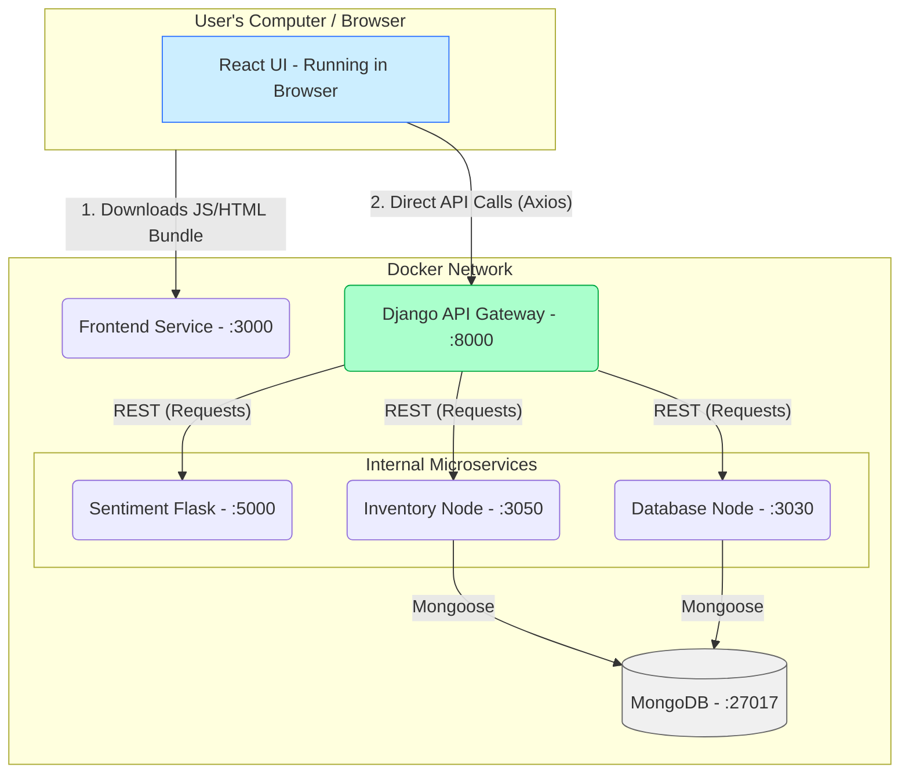

# Automobile Dealership Full-Stack Application

## Overview
This project is a comprehensive **Full-Stack Management System** designed for a national automobile dealership network. It enables users to explore dealer locations, view live car inventories, and manage customer reviews. A key feature is the integrated **Sentiment Analysis**, which automatically evaluates the tone of customer feedback.

The application is built on a **Microservices Architecture**, leveraging a polyglot technical stack (Python, Node.js, and React) orchestrated through **Docker Compose** for seamless deployment.

---

## High-Level Architecture

The system follows a **Decoupled SPA (Single Page Application)** architecture, distinguishing between the static UI delivery and dynamic data exchange.

### Component Architecture & Data Flow




### Communication Logic
* **Frontend-to-Backend**: The **React Frontend** uses the **Axios** library to perform asynchronous HTTP requests directly from the user's browser to the Django API Gateway.
* **Internal Service Mesh**: The **Django Backend** acts as a central orchestrator. It uses the Python **Requests** library to communicate internally with Node.js and Flask microservices within the Docker network.

### Data Persistence Strategy
The project utilizes a dual-database approach:
1.  **SQLite (Relational)**: Embedded within the Django service. It manages system data, including user authentication, sessions, and the master catalog of Car Makes and Models.
2.  **MongoDB (NoSQL)**: A dedicated document store used by the Node.js microservices. It handles unstructured data like dealership details and customer reviews.

---

## Project Structure (Updated)

Following the architectural migration, the project is organized to separate the Client (Frontend) from the Server-side services.

```text
IBM_Fullstack_Capstone/
├── server/                 # Server-side logic & Microservices
│   ├── djangoapp/          # Django App (API Gateway, Auth, SQLite ORM)
│   ├── djangoproj/         # Project-wide Django configuration
│   ├── database/           # Node.js service for Dealer/Review data (MongoDB)
│   ├── carsInventory/      # Node.js service for Car inventory (MongoDB)
│   ├── djangoapp/microservices/ # Flask service for NLP Sentiment Analysis
│   ├── Dockerfile          # Django Backend Docker configuration
│   └── entrypoint.sh       # Backend startup script (migrations & server)
├── frontend/               # React.js application (User Interface)
│   ├── src/                # React components and UI logic
│   ├── public/             # Static assets
│   └── Dockerfile          # Frontend Docker configuration
├── docker-compose.yaml      # Unified Orchestrator (Single Source of Truth)
└── README.md               # Main project documentation (this file)
```
---

## Deployment & Getting Started

### Prerequisites
* **Docker Desktop** (version 20.10+ recommended)
* **Docker Compose**

### Global Installation
To build the images and launch the entire ecosystem (containers, networks, and volumes), run the following command from the root directory:

```bash
docker compose up --build
```

---

## Accessing the Application

Once the build is complete and containers are healthy, you can access the different layers of the ecosystem at the following addresses:

* **User Interface**: [http://localhost:3000](http://localhost:3000)
* **Django Admin Panel**: [http://localhost:8000/admin](http://localhost:8000/admin)
* **Database API (Node)**: [http://localhost:3030](http://localhost:3030)
* **Sentiment Analyzer (Flask)**: [http://localhost:5000](http://localhost:5000)

---

## Technology Stack Summary

| Layer | Technology | Key Communication Library |
| :--- | :--- | :--- |
| **User Interface** | React.js | **Axios** |
| **API Gateway** | Django (Python) | **Requests** |
| **System Database** | **SQLite** | Django ORM |
| **Document Store** | **MongoDB** | Mongoose (Node.js Driver) |
| **NLP Engine** | Flask (Python) | NLTK (VADER Lexicon) |
| **Orchestration** | Docker | Docker Compose |

---

## Documentation Hierarchy

This file provides a high-level "macro" overview. For deep-dive technical details on specific modules, please refer to their respective documentation files:

* **`frontend/README.md`**: Detailed view of UI components and React state management.
* **`server/djangoapp/README.md`**: Deep dive into Django views, Authentication logic, and SQLite models.
* **`server/database/README.md`**: Full documentation on MongoDB schemas and Node.js API endpoints.