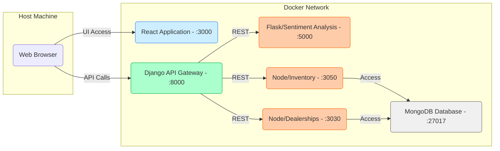

# Server & Microservices Context

## Overview

This `server` directory serves as the **backend core** of the application. It hosts the Django API Gateway and coordinates various microservices. Following the architectural optimization, the **frontend has been moved to the project root** to ensure a clean separation of concerns.

In the Docker ecosystem, this directory provides the build context for the Django application, managing the orchestration between the relational data (SQLite) and external microservices.

---

## Key Subdirectories

The backend logic and internal services are structured as follows:

| Directory | Role | Description |
| :--- | :--- | :--- |
| **`djangoapp/`** | **Application Logic** | Contains Models, Views (API endpoints), and the core business logic for the Django backend. |
| **`djangoproj/`** | **Configuration** | Global settings, URL routing, and WSGI/ASGI configurations for the Django project. |
| **`database/`** | **Node.js Data Service** | Microservice managing Dealership and Review data (connected to MongoDB). |
| **`carsInventory/`** | **Inventory Service** | Node.js microservice specifically for managing vehicle inventory. |
| **`djangoapp/microservices/`** | **Sentiment Analysis** | Flask-based NLP service for evaluating customer feedback tone. |

---

## Microservices Architecture

The system uses a containerized microservices architecture. The Django Backend acts as the **API Gateway**, centralizing requests from the React Frontend and distributing them to the specialized internal services.

### 1. Component Architecture Diagram

This diagram illustrates the updated flow where the Frontend and Server reside as sibling services within the Docker network.

## 2. Service Roles (Server Context)

| Component | Description | Exposed Port (Host) |
| :--- | :--- | :--- |
| **DjangoBackend** | Main API Entry point, Authentication, and Orchestration. | 8000 |
| **SentimentAPI** | Python Flask microservice for text analysis (NLP). | 5000 |
| **InventoryAPI** | Node.js microservice for managing car inventory. | 3050 |
| **DatabaseAPI** | Node.js service for dealership and review documents. | 3030 |
| **MongoDB** | NoSQL Data storage for dealerships and reviews. | 27018 |
